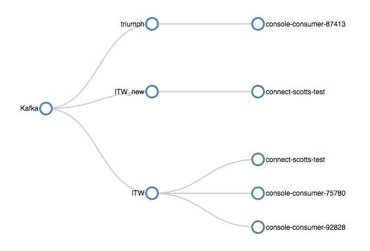
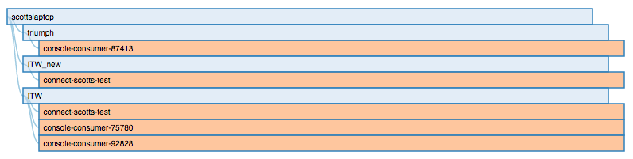

# ConsumerGraph

A small utility to browse Kafka topic-to-consumer relationships. Each node is collapsible.

***NOTE*** - This supports installations with offsets stored in Kafka. Offsets stored in Zookeeper are not supported.

***Graph View:***

***Tree View:***

# Docker Configuration Environment Variables
The following env vars are recognized by the image:

| Name                         |   Default   | Description                |                 Example                  |
|:-----------------------------|:-----------:|:--------------------------------------------------------------------------------------------|:----------------------------------------:|
|`CLUSTER_NAME` | `Kafka` | The name of this Kafka cluster. Displayed on the root node. | `kafkaone` |
|`PORT` | ***NONE***  | The port the server runs on. | `8080` |
|`KAFKA_BROKERS` | ***NONE***  | A list of Kafka brokers for the cluster to monitor. | `kafkaone.server.com:9092,kafkatwo.server.com:9092` |
|`CONSUMER_TIMEOUT` | ***NONE***  | The time the consumer spends waiting in poll() if data is not available, in milliseconds. | `30000` |
|`TOPIC_FILTER` | ***NONE***  | A regex to filter out topics. | _.*&#124;console.\* |
|`CONSUMER_FILTER` | ***NONE***  | A regex to filter out consumers. | _.*&#124;console.\* |
|`LOG_LEVEL` | ***NONE*** | The logging level for log4j, [ALL &#124; DEBUG &#124; ERROR &#124; FATAL &#124; INFO &#124; OFF &#124; TRACE &#124; WARN] | `INFO` |
|`UI_STYLE` | ***NONE*** | The UI style to use, [graph &#124; tree] | `tree` |

# Building and Running
ConsumerGraph is available on [Docker hub](https://hub.docker.com/search/?q=consumergraph).

The easiest way to build it is via the build script. You will need Maven and Docker installed.
~~~~~
$ ./build.sh
$ docker run -p 9913:9913 \
 	-e PORT=9913 \
 	-e CLUSTER_NAME=kafka_one \
 	-e KAFKA_BROKERS=172.27.24.93:9092 \
 	-e TOPIC_FILTER="_.*|console.*" \
 	-e LOG_LEVEL=INFO \
 	-e UI_STYLE=tree \
 	-e CONSUMER_TIMEOUT=30000 \
 	consumergraph
~~~~~

# Development
You can build ConsumerGraph with the Maven using the standard lifecycle phases.

# Version Compatibility
This was built/tested using the following versions.

| Component | Version |
|:------------------|:-----------|
| Maven | `3.3.9` |
| Docker | `17.03.0-ce, build 60ccb22` |
| Java | `1.8.0_121` |
| Kafka | `0.10.1.0` |
